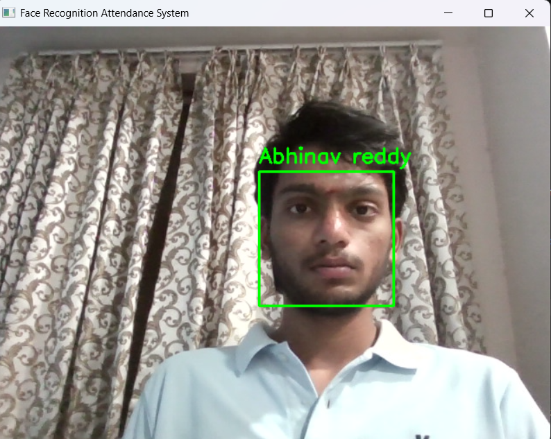

# Face Recognition Attendance System

## About the Project
This project is a Python-based attendance system that uses face recognition through webcam. It automatically detects and identifies registered faces and marks attendance in a CSV file.

## How it Works
1. Register faces using webcam images.
2. System creates face encodings from stored images.
3. Webcam detects faces in real time.
4. If a known face is found, attendance is marked.

## Features
- Face detection using webcam
- Face recognition using face_recognition library
- Automatic attendance marking
- CSV file storage
- Real-time processing

## Technologies Used
- Python
- OpenCV
- face_recognition
- NumPy
- Pandas

## Project Files
- register_face.py → Register new faces
- attendance_system.py → Main recognition system
- face_detector.py → Face detection helper
- attendance.csv → Stores attendance records

## How to Run
Install dependencies:
pip install -r requirements.txt

Register faces:
python register_face.py

Run system:
python attendance_system.py
## Screenshot

The system successfully detects and recognizes faces in real time using webcam input. Once a registered face is identified, the system marks attendance automatically.

### Face Recognition Output

